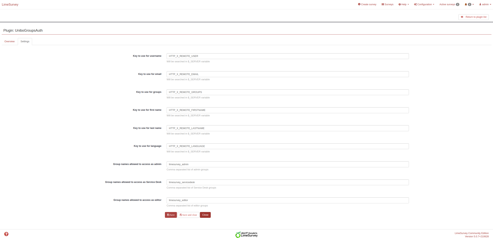

# UniboGroupsAuth - LimeSurvey Plugin
A simple LimeSurvey plugin to Automatically add participants to a survay based on header info.

**Author**: Matteo Parrucci  
**Email**: m.parrucci@unibo.it  
**Website**: https://www.github.com/unibo  
**Licence**: BSD 3-Clause  
**LimeSurvey compatibility**: 4.X , 5.X

## Headers structure:
The only required headers to make the authorization process work are X-Remote-User and X-Remote-Groups.  
Headers could, and in our case are, added by the proxy after verifying the user is authenticated using an apache plugin.

## How to test this plugin:
In production you will better have some authentication in place on the proxy and add the required headers in order to make it work but in development you can also use a chrome extension like ModHeader that let you set your own headers.  
N.B. In production, to avoid people compiling the surveys using such extension, it is required to remove those headers from requests before running the auth plugin that eventually adds them back with the right contents.

## Plugin configurations:
- **Key to use for username**: Header key to check in $_SERVER to retrive the username (defaults to HTTP_X_REMOTE_USER)  
- **Key to use for email**: Header key to check in $_SERVER to retrive the email (defaults to HTTP_X_REMOTE_EMAIL)  
- **Key to use for groups**: Header key to check in $_SERVER to retrive the comma separated groups (defaults to HTTP_X_REMOTE_GROUPS)  
- **Key to use for first name**: Header key to check in $_SERVER to retrive the first name (defaults to HTTP_X_REMOTE_FIRSTNAME)  
- **Key to use for last name**: Header key to check in $_SERVER to retrive the last name (deafults to HTTP_X_REMOTE_LASTNAME)  

## Survey additional configuration:
- **Group names**: The comma separated list of allowed groups to compile this specific survey (defaults to empty). If empty it will always ask for a token.

## Installation instructions:
- Clone this repository inside the plugin directory of your LimeSurvey installation

## Docker
This plugin also contains a docker folder. It is used to develop and it is made of nginx -> php-fpm -> mariadb.  
Please remember to change the database password if using on production.  
TODO: Put all environment dependend parameters like domain and DB password in an .env file that will be in the .gitignore. Push a .env.example instead.

## Notes: 
- This plugin only does its magic on survey with specified participants, it does nothing in open participants surveys.
- This plugin dynamically adds a new participants to the survey participant table and assigns them a token before redirecting to the survey with the needed token in querystring.

## Screenshots

